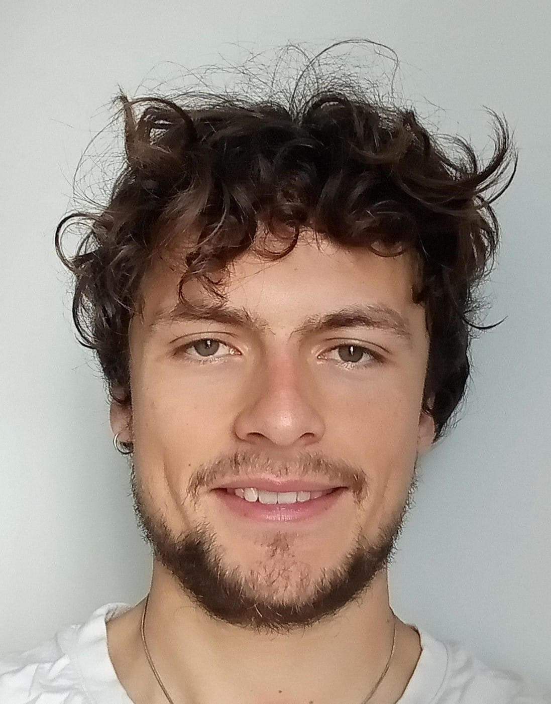

---
title: Page of Sebastien Labbe
...

* Email: sebastien DOT labbe AT univ-lille DOT fr
* Current position: PhD at CRIStAL/UNIV-LILLE in [DDAL team](https://ddal.inria.fr/) with [Antoine Amarilli](https://a3nm.net/) and [Charles Paperman](https://paperman.name/). 
* [CV](pdfs/cv.pdf)

# PhD subject

My main area of interest are <i>automata theory</i>, <i>dynamic tree algorithms</i> and <i>algebraic monoids</i>.
 I especially try to find lower and upper bounds for <strong>tree automata on dynamic trees</strong>.

# Publications list

[dblp](https://dblp.org/pid/344/5949.html)

* [<b>Analytical Integral Global Optimization</b>](https://proceedings.mlr.press/v283/labbe25a.html)
 Sebastien Labbe, [Andrea Del Prete](https://andreadelprete.github.io/)

* [<b>When-Provenance: Leveraging Provenance Semirings for Temporal Data Tracking</b>](https://ceur-ws.org/Vol-3954/paper6243.pdf)
 Sebastien Labbe, Samuele Langhi, [Angela Bonifati](https://perso.liris.cnrs.fr/angela.bonifati/) and [Riccardo Tommasini](https://www.riccardotommasini.com/)

* [<b>Skyline Operators for Document Spanners</b>](https://drops.dagstuhl.de/entities/document/10.4230/LIPIcs.ICDT.2024.7)
 [Antoine Amarilli](https://a3nm.net/), [Benny Kimelfeld](https://benny.cs.technion.ac.il/), Sebastien Labbe, [Stefan Mengel](https://www.cril.univ-artois.fr/~mengel/)

